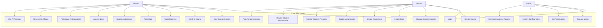

```mermaid
graph TD
    subgraph "LearnFlix System"
        A[Login]
        B[View Course Content]
        C[Enroll in Course]
        D[Track Progress]
        E[Take Quiz]
        F[Submit Assignment]
        G[Access Notes]
        H[Participate in Discussions]
        I[Receive Certificate]
        J[Use AI Assistant]
        
        K[Create Course]
        L[Manage Course Content]
        M[Create Quiz]
        N[Create Assignment]
        O[Grade Assignments]
        P[Monitor Student Progress]
        Q[Review Student Performance]
        R[Post Announcements]
        
        S[Manage Users]
        T[Set Permissions]
        U[System Configuration]
        V[Generate Analytics Reports]
    end
    
    Student --> A
    Student --> B
    Student --> C
    Student --> D
    Student --> E
    Student --> F
    Student --> G
    Student --> H
    Student --> I
    Student --> J
    
    Teacher --> A
    Teacher --> K
    Teacher --> L
    Teacher --> M
    Teacher --> N
    Teacher --> O
    Teacher --> P
    Teacher --> Q
    Teacher --> R
    
    Admin --> A
    Admin --> S
    Admin --> T
    Admin --> U
    Admin --> V
```